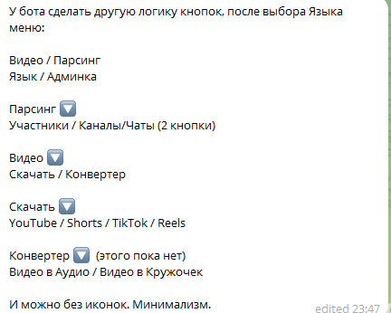

@twitris_bot у меня есть такой бот для работы с видео, надо в нем структуру выходит поменять слегка, ну и добавить Парсинг TG

cloud.google.com

instance-6 - тут бот лежит.

6363771620:AAEYUGfmHDlMVDEt3Tq49raV8LM2tlBTs60

Бот активируется только после привязки к каналу @expert_tm так он будет бесплатным. Сохранить старый функционал, рассылка по пользователям, статистика

Нужно добавить конвертацию видео в кружок.

Добавить возможность доната через wallet api.

добавить админку

для парсинга использовать https://tlgrm.ru/channels 

https://typesense.tlgrm.app/collections/channels/documents/search?q=%D1%84%D0%B5%D0%BC&query_by=name%2Ctags%2Clink&per_page=6&page=1&query_by_weights=120%2C20%2C10&sort_by=official%3Adesc%2Csubscribers%3Adesc%2C_text_match%3Adesc&filter_by=lang%3A%5Bna%2Cru%2Cen%2Csr%2Cbg%5D&highlight_fields=_&min_len_1typo=5&min_len_2typo=8

X-Typesense-Api-Key:
RGhGeG1DWG1jTExUem14YVM0a2wrQ2xtMXdDUVBaYXdidU12dFVHVHpCcz1lUmE4eyJleGNsdWRlX2ZpZWxkcyI6InRhZ3MifQ==